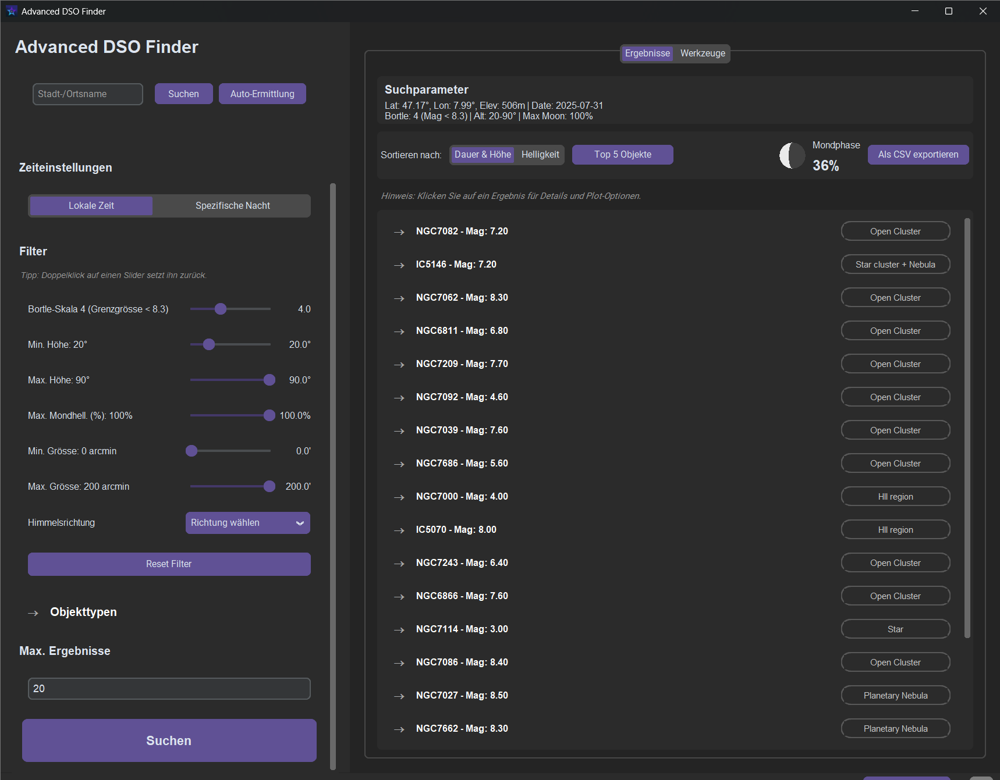

# Advanced DSO Finder - Bedienungsanleitung

Willkommen bei der offiziellen Bedienungsanleitung für den Advanced DSO Finder! Dieses Dokument führt Sie durch alle Funktionen der Anwendung, von der Standortermittlung bis zur Analyse astronomischer Objekte.

**Sprachen:** [**Deutsch**](MANUAL.de.md) | [English](MANUAL.en.md) | [Español](MANUAL.es.md) | [Français](MANUAL.fr.md) | [日本語](MANUAL.ja.md)

---

## Inhaltsverzeichnis

1.  [Erste Schritte: Die Benutzeroberfläche](#1-erste-schritte-die-benutzeroberfläche)
2.  [Standort und Zeit einstellen](#2-standort-und-zeit-einstellen)
    *   [Manuelle Eingabe](#manuelle-eingabe)
    *   [Standortsuche & Auto-Ermittlung](#standortsuche--auto-ermittlung)
    *   [Zeiteinstellungen](#zeiteinstellungen)
3.  [Objekte filtern](#3-objekte-filtern)
    *   [Bortle-Skala & Grenzgröße](#bortle-skala--grenzgröße)
    *   [Objekthöhe und Größe](#objekthöhe-und-größe)
    *   [Mondhelligkeit](#mondhelligkeit)
    *   [Objekttypen](#objekttypen)
    *   [Himmelsrichtung](#himmelsrichtung)
4.  [Ergebnisse verstehen und nutzen](#4-ergebnisse-verstehen-und-nutzen)
    *   [Ergebnisliste](#ergebnisliste)
    *   [Objektdetails](#objektdetails)
    *   [Grafische Analyse (Plots)](#grafische-analyse-plots)
5.  [Die Werkzeuge-Tabs](#5-die-werkzeuge-tabs)
    *   [Manuelle Zieleingabe](#manuelle-zieleingabe)
    *   [Rotverschiebungsrechner](#rotverschiebungsrechner)
    *   [Sonnenzeiten-Rechner](#sonnenzeiten-rechner)
6.  [Fehlerbehebung (FAQ)](#6-fehlerbehebung-faq)

---

### 1. Erste Schritte: Die Benutzeroberfläche

Die Oberfläche ist in zwei Hauptbereiche unterteilt:
*   **Linke Seitenleiste:** Hier finden Sie alle Eingabefelder und Filter, um Ihre Suche zu definieren.
*   **Rechter Hauptbereich:** Hier werden die Suchergebnisse und die zusätzlichen Werkzeuge in Tabs angezeigt.

---

### 2. Standort und Zeit einstellen

Die Genauigkeit aller Berechnungen hängt von einem präzisen Standort und Datum ab.

#### Manuelle Eingabe
Geben Sie Ihre **Breiten- (Latitude)** und **Längengrade (Longitude)** direkt in die entsprechenden Felder ein.
*   Nördliche Breitengrade und östliche Längengrade sind positiv (z.B. `47.05`).
*   Südliche Breitengrade und westliche Längengrade sind negativ (z.B. `-33.92`).
Die **Höhe (Elevation)** über dem Meeresspiegel in Metern verbessert die Genauigkeit der Berechnungen, besonders bei Horizontnähe.

#### Standortsuche & Auto-Ermittlung
*   **Suche:** Geben Sie einen Orts- oder Stadtnamen in das Suchfeld ein und klicken Sie auf "Suchen". Die App füllt die Koordinaten automatisch aus.
*   **Auto-Ermittlung:** Klicken Sie auf "Auto-Ermittlung", um Ihren ungefähren Standort über Ihre IP-Adresse zu bestimmen. Dies ist schnell und bequem, kann aber ungenauer sein als eine manuelle Suche.

#### Zeiteinstellungen
*   **Jetzt (heute Nacht):** Verwendet die aktuelle Nacht (Sonnenuntergang bis Sonnenaufgang) für die Berechnung.
*   **Spezifische Nacht:** Klicken Sie darauf, um ein Eingabefeld für das Datum zu öffnen. Ein Klick auf das Feld öffnet einen Kalender zur einfachen Auswahl eines beliebigen Datums.

---

### 3. Objekte filtern

Mit den Filtern schränken Sie die Suche auf die für Sie relevanten Himmelsobjekte ein.

#### Bortle-Skala & Grenzgröße
Die **Bortle-Skala** ist ein Maß für die Lichtverschmutzung an Ihrem Standort (1 = exzellenter dunkler Himmel, 9 = Innenstadt). Die App berechnet daraus automatisch eine realistische **Grenzgröße (Magnitude)** für die Sichtbarkeit mit einem Teleskop. Nur Objekte, die heller als dieser Wert sind, werden angezeigt.

#### Objekthöhe und Größe
*   **Min. Höhe:** Legt fest, wie hoch ein Objekt über dem Horizont mindestens stehen muss, um in den Ergebnissen zu erscheinen. Ein Wert von `20°` oder `30°` wird empfohlen, um Dunst und Horizont-nahe Hindernisse zu vermeiden.
*   **Max. Höhe:** Die maximale Höhe, die ein Objekt erreichen darf. Normalerweise auf `90°` (Zenit) belassen.
*   **Min./Max. Größe:** Filtert Objekte nach ihrer scheinbaren Größe am Himmel in Bogenminuten (arcmin). Nützlich, um entweder nur große, ausgedehnte Objekte oder kleine, planetarische Nebel zu finden.

#### Mondhelligkeit
*   **Max. Mondhell. (%):** Ein entscheidender Filter. Wenn die Mondbeleuchtung in der gewählten Nacht diesen Wert übersteigt, werden keine Ergebnisse angezeigt, da der Mond lichtschwache Objekte überstrahlen würde. Setzen Sie den Wert auf `10%` für die Beobachtung lichtschwacher Galaxien oder auf `100%`, wenn Sie nur helle Objekte suchen.

#### Objekttypen
Wählen Sie hier die Kategorien von Himmelsobjekten aus, an denen Sie interessiert sind (z.B. Galaxien, Nebel, Sternhaufen). Über die Buttons "Alle auswählen" und "Keine auswählen" können Sie schnell Anpassungen vornehmen.

#### Himmelsrichtung
Schränkt die Suche auf Objekte ein, die ihren höchsten Punkt in einer bestimmten Himmelsrichtung (z.B. "Süden") erreichen. Ideal, wenn Ihr Beobachtungsplatz in eine Richtung blockiert ist.

---

### 4. Ergebnisse verstehen und nutzen

Nach einem Klick auf "Suchen" erscheinen die Ergebnisse im rechten Hauptbereich.

#### Ergebnisliste
Die Objekte werden standardmäßig nach einer Kombination aus Sichtbarkeitsdauer und maximaler Höhe sortiert. Sie können die Sortierung auf "Helligkeit" umstellen.
Jeder Eintrag zeigt den Namen, Typ und die Helligkeit des Objekts. Klicken Sie auf einen Eintrag, um ihn zu erweitern.

#### Objektdetails
Im erweiterten Bereich sehen Sie detaillierte Informationen:
*   **Max. Höhe:** Die höchste Position, die das Objekt in der Nacht erreicht.
*   **Beste Zeit (lokal):** Die Uhrzeit, zu der das Objekt diese maximale Höhe erreicht. Dies ist der optimale Beobachtungszeitpunkt.
*   **Sichtb. Dauer:** Die Anzahl der Stunden, die das Objekt über dem Horizont sichtbar ist.
*   **Sternbild, Größe, RA/Dek:** Zusätzliche astronomische Daten.

#### Grafische Analyse (Plots)
*   **Höhenverlauf:** Zeigt ein Diagramm der Objekthöhe über die Nacht an. Ideal, um den besten Beobachtungszeitraum zu visualisieren.
*   **Himmelsbahn:** Zeigt den Pfad des Objekts über den Himmel von Aufgang bis Untergang.

---

### 5. Die Werkzeuge-Tabs

#### Manuelle Zieleingabe
Suchen Sie nach einem bestimmten Objekt (z.B. "NGC 224") oder geben Sie RA/Dek-Koordinaten direkt ein, um die Sichtbarkeit für ein beliebiges Ziel zu berechnen. Sie können häufig verwendete Ziele hier auch speichern und wieder laden.

#### Rotverschiebungsrechner
Ein Werkzeug für Kosmologie-Interessierte. Geben Sie eine Rotverschiebung (z) ein, um kosmologische Entfernungen und die Rückblickzeit zu berechnen. Die Kontexte geben an, aus welcher Ära des Universums das Licht stammt.

#### Sonnenzeiten-Rechner
Berechnet die exakten Zeiten für Sonnenaufgang, Sonnenuntergang, den Sonnenmittag und die Tageslänge für Ihren gewählten Standort und das Datum.

---

### 6. Fehlerbehebung (FAQ)

*   **F: Warum erhalte ich keine Ergebnisse?**
    *   **A:** Überprüfen Sie Ihre Filter. Die häufigsten Ursachen sind:
        1.  Der Mond ist zu hell (`Max. Mondhell.` zu niedrig eingestellt).
        2.  Der `Min. Höhe`-Filter ist zu hoch eingestellt.
        3.  Keine Objekttypen sind ausgewählt.
        4.  Die gewählte Nacht liegt im Sommer in einer polnahen Region, wo es nicht dunkel wird.

*   **F: Die Auto-Ermittlung meines Standorts ist ungenau.**
    *   **A:** Die IP-basierte Geolokalisierung kann ungenau sein. Für präzise Ergebnisse verwenden Sie die manuelle Suche nach Ihrem Ort oder geben Sie Ihre Koordinaten direkt ein.

---
Haben Sie einen Fehler gefunden oder einen Verbesserungsvorschlag? Erstellen Sie bitte ein [Issue auf GitHub](https://github.com/Champion-22/ADSOFinder/issues).
