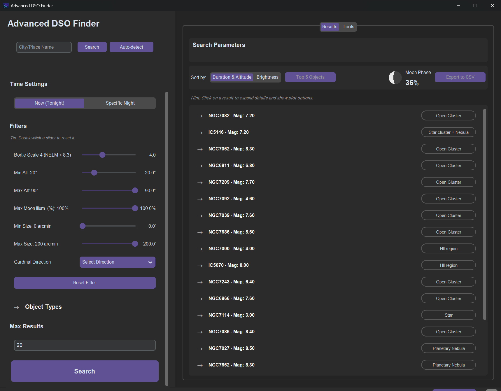

# Advanced DSO Finder - User Manual

Welcome to the official user manual for the Advanced DSO Finder! This document will guide you through all the features of the application, from setting your location to analyzing astronomical objects.

**Languages:** [Deutsch](MANUAL.de.md) | [**English**](MANUAL.en.md) | [Español](MANUAL.es.md) | [Français](MANUAL.fr.md) | [日本語](MANUAL.ja.md)

---

## Table of Contents

1.  [Getting Started: The User Interface](#1-getting-started-the-user-interface)
2.  [Setting Location and Time](#2-setting-location-and-time)
    *   [Manual Input](#manual-input)
    *   [Location Search & Auto-Detection](#location-search--auto-detection)
    *   [Time Settings](#time-settings)
3.  [Filtering Objects](#3-filtering-objects)
    *   [Bortle Scale & Limiting Magnitude](#bortle-scale--limiting-magnitude)
    *   [Object Altitude and Size](#object-altitude-and-size)
    *   [Moon Illumination](#moon-illumination)
    *   [Object Types](#object-types)
    *   [Cardinal Direction](#cardinal-direction)
4.  [Understanding and Using the Results](#4-understanding-and-using-the-results)
    *   [Result List](#result-list)
    *   [Object Details](#object-details)
    *   [Graphical Analysis (Plots)](#graphical-analysis-plots)
5.  [The Tools Tabs](#5-the-tools-tabs)
    *   [Manual Target Input](#manual-target-input)
    *   [Redshift Calculator](#redshift-calculator)
    *   [Sun Times Calculator](#sun-times-calculator)
6.  [Troubleshooting (FAQ)](#6-troubleshooting-faq)

---

### 1. Getting Started: The User Interface

The interface is divided into two main areas:
*   **Left Sidebar:** Here you will find all the input fields and filters to define your search.
*   **Right Main Area:** This area displays the search results and additional tools in tabs.

---

### 2. Setting Location and Time

The accuracy of all calculations depends on a precise location and date.

#### Manual Input
Enter your **Latitude** and **Longitude** directly into the corresponding fields.
*   Northern latitudes and eastern longitudes are positive (e.g., `47.05`).
*   Southern latitudes and western longitudes are negative (e.g., `-33.92`).
The **Elevation** above sea level in meters improves the accuracy of calculations, especially near the horizon.

#### Location Search & Auto-Detection
*   **Search:** Enter a place or city name into the search field and click "Search". The app will automatically fill in the coordinates.
*   **Auto-Detection:** Click "Auto-detect" to determine your approximate location via your IP address. This is fast and convenient but may be less accurate than a manual search.

#### Time Settings
*   **Now (Tonight):** Uses the current night (from sunset to sunrise) for the calculation.
*   **Specific Night:** Click this to reveal a date input field. Clicking the field opens a calendar for easy selection of any date.

---

### 3. Filtering Objects

Use the filters to narrow down the search to the celestial objects relevant to you.

#### Bortle Scale & Limiting Magnitude
The **Bortle Scale** is a measure of the light pollution at your location (1 = excellent dark sky, 9 = city center). The app automatically calculates a realistic **limiting magnitude** for visibility with a telescope. Only objects brighter than this value will be displayed.

#### Object Altitude and Size
*   **Min Alt:** Defines the minimum altitude an object must have above the horizon to appear in the results. A value of `20°` or `30°` is recommended to avoid haze and near-horizon obstacles.
*   **Max Alt:** The maximum altitude an object may reach. Usually left at `90°` (zenith).
*   **Min/Max Size:** Filters objects by their apparent size in the sky in arcminutes. Useful for finding either only large, extended objects or small, planetary nebulae.

#### Moon Illumination
*   **Max Moon Illum. (%):** A crucial filter. If the moon's illumination on the selected night exceeds this value, no results will be shown, as the moon would outshine faint objects. Set the value to `10%` for observing faint galaxies or to `100%` if you are only searching for bright objects.

#### Object Types
Select the categories of celestial objects you are interested in (e.g., Galaxies, Nebulae, Clusters). Use the "Select All" and "Select None" buttons to make quick adjustments.

#### Cardinal Direction
Restricts the search to objects that reach their highest point in a specific cardinal direction (e.g., "South"). Ideal if your observation spot is obstructed in one direction.

---

### 4. Understanding and Using the Results

After clicking "Search," the results will appear in the right main area.

#### Result List
By default, objects are sorted by a combination of visibility duration and maximum altitude. You can switch the sorting to "Brightness".
Each entry shows the object's name, type, and magnitude. Click on an entry to expand it.

#### Object Details
In the expanded view, you will see detailed information:
*   **Max. Altitude:** The highest position the object reaches during the night.
*   **Best Time (local):** The time at which the object reaches this maximum altitude. This is the optimal viewing time.
*   **Visible Duration:** The number of hours the object is visible above the horizon.
*   **Constellation, Size, RA/Dec:** Additional astronomical data.

#### Graphical Analysis (Plots)
*   **Altitude Profile:** Shows a chart of the object's altitude throughout the night. Ideal for visualizing the best observation window.
*   **Sky Path:** Displays the object's path across the sky from rise to set.

---

### 5. The Tools Tabs

#### Manual Target Input
Search for a specific object (e.g., "NGC 224") or enter RA/Dec coordinates directly to calculate the visibility for any target. You can also save and load frequently used targets here.

#### Redshift Calculator
A tool for those interested in cosmology. Enter a redshift (z) to calculate cosmological distances and the lookback time. The context descriptions indicate which era of the universe the light is from.

#### Sun Times Calculator
Calculates the exact times for sunrise, sunset, solar noon, and the length of the day for your chosen location and date.

---

### 6. Troubleshooting (FAQ)

*   **Q: Why am I not getting any results?**
    *   **A:** Check your filters. The most common reasons are:
        1.  The Moon is too bright (`Max Moon Illum.` is set too low).
        2.  The `Min. Alt` filter is set too high.
        3.  No object types are selected.
        4.  The selected night is during summer in a near-polar region where it does not get dark.

*   **Q: The auto-detection of my location is inaccurate.**
    *   **A:** IP-based geolocation can be imprecise. For accurate results, use the manual search for your location or enter your coordinates directly.

---
Found a bug or have a suggestion for improvement? Please create an [Issue on GitHub](https://github.com/Champion-22/ADSOFinder/issues).
