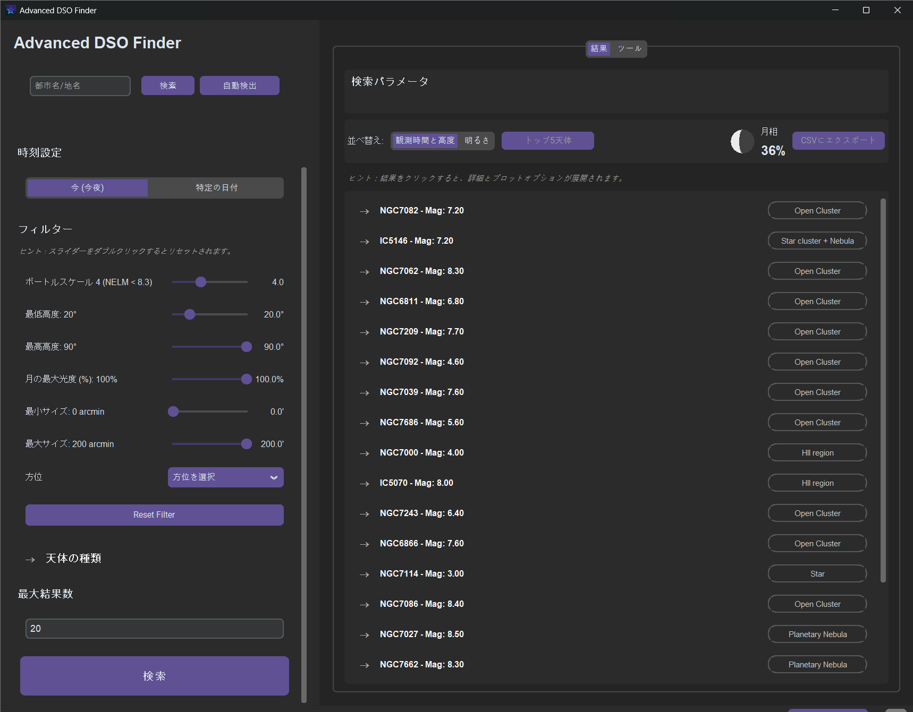

# Advanced DSO Finder - ユーザーマニュアル

Advanced DSO Finderの公式ユーザーマニュアルへようこそ！このドキュメントでは、観測地の設定から天体の分析まで、アプリケーションの全機能についてご案内します。

**言語:** [Deutsch](MANUAL.de.md) | [English](MANUAL.en.md) | [Español](MANUAL.es.md) | [Français](MANUAL.fr.md) | [**日本語**](MANUAL.ja.md)

---

## 目次

1.  [はじめに：ユーザーインターフェース](#1-はじめにユーザーインターフェース)
2.  [観測地と時刻の設定](#2-観測地と時刻の設定)
    *   [手動入力](#手動入力)
    *   [場所の検索と自動検出](#場所の検索と自動検出)
    *   [時刻設定](#時刻設定)
3.  [天体のフィルタリング](#3-天体のフィルタリング)
    *   [ボートルスケールと限界等級](#ボートルスケールと限界等級)
    *   [天体の高度とサイズ](#天体の高度とサイズ)
    *   [月の光度](#月の光度)
    *   [天体の種類](#天体の種類)
    *   [方位](#方位)
4.  [結果の理解と活用](#4-結果の理解と活用)
    *   [結果リスト](#結果リスト)
    *   [天体の詳細](#天体の詳細)
    *   [グラフィック分析（プロット）](#グラフィック分析プロット)
5.  [ツールタブ](#5-ツールタブ)
    *   [手動ターゲット入力](#手動ターゲット入力)
    *   [赤方偏移計算機](#赤方偏移計算機)
    *   [太陽時間計算機](#太陽時間計算機)
6.  [トラブルシューティング (FAQ)](#6-トラブルシューティング-faq)

---

### 1. はじめに：ユーザーインターフェース

インターフェースは主に2つのエリアに分かれています：
*   **左サイドバー:** 検索を定義するためのすべての入力フィールドとフィルターがあります。
*   **右メインエリア:** 検索結果と追加ツールがタブで表示されます。

---

### 2. 観測地と時刻の設定

すべての計算の精度は、正確な観測地と日付に依存します。

#### 手動入力
**緯度（Latitude）**と**経度（Longitude）**を対応するフィールドに直接入力します。
*   北緯と東経は正の値です（例：`47.05`）。
*   南緯と西経は負の値です（例：`-33.92`）。
海抜**高度（Elevation）**をメートル単位で入力すると、特に地平線近くの計算精度が向上します。

#### 場所の検索と自動検出
*   **検索:** 場所や都市名を検索フィールドに入力し、「検索」をクリックします。アプリが自動的に座標を補完します。
*   **自動検出:** 「自動検出」をクリックすると、IPアドレスからおおよその現在地を特定します。これは高速で便利ですが、手動検索より精度が低い場合があります。

#### 時刻設定
*   **今（今夜）:** 計算には現在の日付の夜（日没から日の出まで）が使用されます。
*   **特定の日付:** これをクリックすると日付入力フィールドが表示されます。フィールドをクリックするとカレンダーが開き、任意の日付を簡単に選択できます。

---

### 3. 天体のフィルタリング

フィルターを使って、興味のある天体に絞り込んで検索します。

#### ボートルスケールと限界等級
**ボートルスケール**は、観測地の光害のレベルを示す指標です（1 = 最高の暗い空、9 = 都心）。アプリはこれに基づき、望遠鏡での観測に現実的な**限界等級（Magnitude）**を自動的に計算します。この値より明るい天体のみが表示されます。

#### 天体の高度とサイズ
*   **最低高度:** 結果に表示されるために天体が地平線からどれだけ高くあるべきかを設定します。地平線近くの霞や障害物を避けるため、`20°`や`30°`の値が推奨されます。
*   **最高高度:** 天体が到達できる最高の高度です。通常は`90°`（天頂）のままにします。
*   **最小/最大サイズ:** 天空での見かけのサイズ（分角）で天体をフィルタリングします。広大な天体や、小さな惑星状星雲だけを見つけたい場合に便利です。

#### 月の光度
*   **月の最大光度 (%):** 非常に重要なフィルターです。選択した夜の月の光度がこの値を超えると、月が暗い天体をかき消してしまうため、結果は表示されません。暗い銀河を観測する場合は`10%`に、明るい天体のみを探す場合は`100%`に設定します。

#### 天体の種類
興味のある天体のカテゴリー（例：銀河、星雲、星団）を選択します。「すべて選択」と「選択なし」ボタンで素早く調整できます。

#### 方位
特定の方位（例：「南」）で最も高くなる天体に検索を絞り込みます。観測場所の一方向が遮られている場合に最適です。

---

### 4. 結果の理解と活用

「検索」をクリックすると、結果が右側のメインエリアに表示されます。

#### 結果リスト
デフォルトでは、天体は可視時間と最高高度の組み合わせでソートされます。「明るさ」にソートを切り替えることもできます。
各項目には、天体の名前、種類、等級が表示されます。項目をクリックすると詳細が表示されます。

#### 天体の詳細
展開されたビューには、詳細な情報が表示されます：
*   **最高高度:** その夜に天体が到達する最も高い位置。
*   **最適な時間（ローカル）:** 天体がこの最高高度に達する時刻。これが最適な観測時間です。
*   **観測可能時間:** 天体が地平線上に現れている時間（時間単位）。
*   **星座、サイズ、赤経/赤緯:** その他の天文データ。

#### グラフィック分析（プロット）
*   **高度プロファイル:** 夜通しの天体の高度をグラフで表示します。最適な観測時間帯を視覚化するのに理想的です。
*   **天空経路:** 天体が昇ってから沈むまでの空での経路を表示します。

---

### 5. ツールタブ

#### 手動ターゲット入力
特定の天体（例：「NGC 224」）を検索するか、赤経/赤緯の座標を直接入力して、任意のターゲットの可視性を計算します。よく使用するターゲットを保存して再読み込みすることもできます。

#### 赤方偏移計算機
宇宙論に興味がある方向けのツールです。赤方偏移（z）を入力して、宇宙論的距離やルックバックタイムを計算します。コンテキストの説明は、その光が宇宙のどの時代からのものかを示します。

#### 太陽時間計算機
選択した場所と日付の日の出、日の入り、太陽正午、昼の長さを正確に計算します。

---

### 6. トラブルシューティング (FAQ)

*   **Q: なぜ結果が表示されないのですか？**
    *   **A:** フィルターを確認してください。最も一般的な原因は次のとおりです：
        1.  月が明るすぎる（`月の最大光度`が低すぎる）。
        2.  `最低高度`フィルターが高すぎる。
        3.  天体の種類が選択されていない。
        4.  選択した夜が、暗くならない極地方の夏である。

*   **Q: 観測地の自動検出が不正確です。**
    *   **A:** IPベースのジオロケーションは不正確な場合があります。正確な結果を得るには、手動で場所を検索するか、座標を直接入力してください。

---
バグを見つけた場合や改善提案がある場合は、[GitHubでIssueを作成してください](https://github.com/Champion-22/ADSOFinder/issues)。
